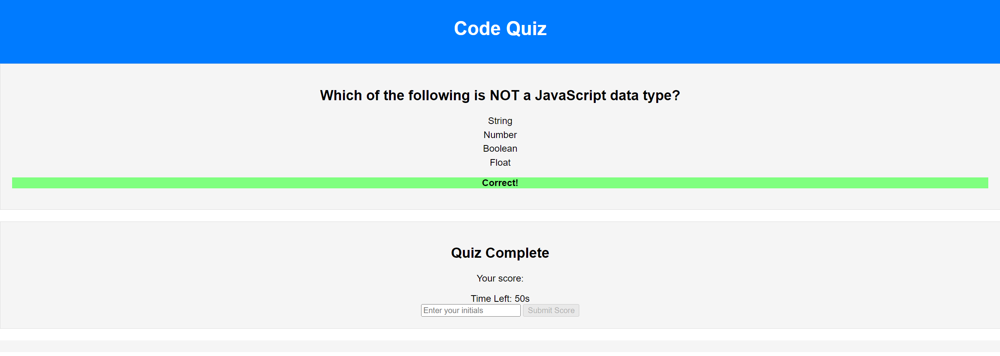

# Code Quiz Web App

## Table of Contents

- [Description](#description)
- [Deployment](#deployment)
- [Application Quality](#application-quality)
- [Repository Quality](#repository-quality)
- [License](#license)

## Description

This is a web application for a timed coding quiz with multiple-choice questions. 

## Deployment

- Live URL: [Add your live application URL here]
- GitHub Repository: [https://github.com/WillxLuong/CodeQuiz]

The application is deployed and can be accessed at the provided live URL. You can also view the source code on GitHub.

## Application Quality

- The application provides an intuitive and easy-to-navigate user experience.
- The user interface style is clean and polished, ensuring an enjoyable quiz-taking experience.
- The functionality closely resembles the mock-up provided in the Challenge instructions.

## Repository Quality

- The repository has a unique name, distinguishing it from other repositories.
- The file structure and naming conventions follow best practices, ensuring organization and clarity.
- Class and ID naming conventions, code indentation, and comments meet high-quality standards.
- The repository contains multiple descriptive commit messages, providing a clear history of changes.
- The README file (this document) includes a description of the project, relevant screenshots, and a link to the deployed application.

## License

This project is licensed under the [MIT License](LICENSE).

